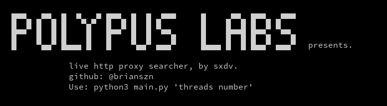

# Proxy Live Checker

This is a Python script that fetches and checks live proxies using multiple threads.



## 🚀 Requirements

- Python 3.x
- Required libraries (check requirements.txt):

```bash
pip install -r requirements.txt
```

## Usage
```bash
python3 main.py 50
```

Obs: 50 is the threads number.
